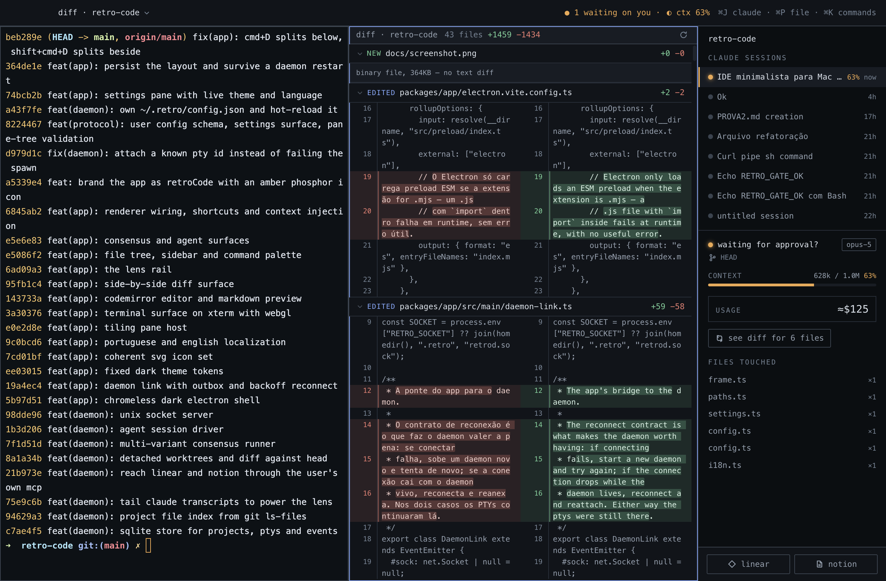

<h1 align="center">retroCode</h1>

<p align="center">
  <strong>Run ten Claude Code sessions without losing track of one.</strong><br>
  A macOS IDE that runs the real CLI in tiled terminals — and puts a live lens
  over every session: which one is waiting on you, what it changed, what it cost.
</p>

<p align="center">
  
  
  
</p>



## Why

Running several `claude` sessions at once is the normal way to work now. The
problem is that a terminal is a river: the transcript scrolls, and with it goes
everything you needed to know. Which session finished? Which one is blocked on a
permission prompt? Which one is about to compact its context? What files did the
one in the other tab actually change?

Claude Code already writes all of that down. It keeps a JSONL transcript per
session under `~/.claude/projects/`, appended line by line while the session
runs. retroCode reads those transcripts live and turns them into a panel.

## The lens

That panel is the whole product. For every session in the focused terminal's
repo it shows:

- **state** — *working*, *your turn*, *waiting for approval?*, *idle*
- **context** used against the model's window, so you see a compaction coming
- **estimated spend**, because the CLI records tokens and not money
- **the files it touched**, and a one-click diff of just those files
- **which session belongs to the pane in front of you** — click a row to jump to
  its pane, or resume one whose terminal is gone

## Design principles

**The real CLI runs inside it.** Not a reimplementation, not an API client with
a chat panel. Terminals here are real ptys running your `$SHELL`, and `claude`
in them is the same binary with your MCP servers, your permissions, your
history.

**The IDE never submits a prompt for you.** Everything it composes — a file, a
Linear issue, a Notion page — is pasted into the composer and left there. You
read it, you edit it, you press enter. Context injection that submits on your
behalf is a different product.

**No credentials in the IDE.** Linear and Notion are fetched through a headless
`claude -p` scoped to a single MCP tool, so the authentication is the one your
CLI already has.

**Your processes outlive the window.** Quit the app and the daemon and its ptys
stay alive; reopen and you get the same panes, the same shells, the scrollback
replayed, and each pane still bound to its claude session.

## Quick start

Requirements: **macOS**, **Node ≥ 25**, [**bun**](https://bun.sh), and the
[**Claude Code CLI**](https://claude.com/claude-code) on your `PATH`.

```bash
git clone https://github.com/Solleris/retroCode.git
cd retroCode
bun install          # postinstall patches three native things — see below
bun run app          # the daemon starts itself
```

Press <kbd>⌘J</kbd> and you have a terminal already running `claude`, with the
lens tracking it on the right.

## Shortcuts

| | |
|---|---|
| <kbd>⌘J</kbd> | new terminal already running `claude` |
| <kbd>⌘T</kbd> | new plain terminal |
| <kbd>⌘D</kbd> / <kbd>⇧⌘D</kbd> | split below / split beside |
| <kbd>⌘W</kbd> | close pane |
| <kbd>⌘]</kbd> <kbd>⌘[</kbd> | cycle panes |
| <kbd>⌘P</kbd> | fuzzy file finder |
| <kbd>⌘K</kbd> | command palette |
| <kbd>⌘E</kbd> | file tree |
| <kbd>⌘O</kbd> | open project |
| <kbd>⌘S</kbd> | save the focused editor |
| <kbd>⇧⌘G</kbd> | diff this repo against HEAD |
| <kbd>⌘,</kbd> | settings |
| <kbd>⇧⌘W</kbd> | close the window |

## Configuration

Everything lives in `~/.retro/config.json`, and the settings pane edits that
same file — what the UI writes is what you would have written by hand, and what
you write by hand shows up in the UI. Saving it recolours the running IDE with
no restart.

```json
{
  "lang": "en",
  "theme": { "signal": "#EFA84C", "focus": "#7AA2F7" },
  "commands": [
    { "id": "monitor", "label": "monitor terminal", "run": "k9s || btop || top" }
  ]
}
```

- `lang` — `en` or `pt`. Omit it to follow the system language.
- `theme` — overrides for the design tokens, without the `--` prefix.
- `commands` — your own entries in the palette; each opens a terminal running
  its snippet.

## Architecture

Two processes, and one rule that decides what goes where.

```
retroCode.app (Electron)      main + preload + renderer
    │ unix socket ~/.retro/retrod.sock
    │ frames: [kind:u8][len:u32be][payload] — JSON for control, raw bytes for ptys
retrod (Node)                 PtyManager · SQLite · transcript watcher · Agent SDK
    │
    └─ /bin/zsh -l            one per terminal
```

**The daemon owns processes, not content.** No text buffer, no AST, no document
crosses that socket — typing latency never pays for an IPC hop. What the daemon
does own is everything with a long life: ptys, the SQLite store, the file
watchers. That is what makes a quit survivable, and a daemon restart too: every
terminal on screen reattaches, or gets a fresh pty if its own died.

<details>
<summary>Why pty bytes get their own frame kind</summary>

A noisy build dumps megabytes per second, and pushing that through JSON would
cost ~33% in base64 plus the parse. The control channel stays JSON because being
readable under `socat` while debugging is worth more than the microseconds.

</details>

<details>
<summary>Three things <code>postinstall</code> repairs</summary>

`scripts/fix-native.mjs` exists because bun does not run install scripts the way
these packages need:

1. **`node-pty`** — bun's store extraction drops the execute bit from
   `spawn-helper`. Every pty spawn then fails with `posix_spawnp failed`, an
   error that mentions permissions nowhere.
2. **`electron`** — its `install.js` (which downloads the ~300MB binary) never
   runs, and `electron-vite dev` fails on an empty `path.txt`.
3. **the dev bundle's identity** — in development the app *is* node_modules'
   `Electron.app`, so macOS shows "Electron" everywhere. The bundle and its
   executable are renamed and `path.txt` is repointed. This is only safe because
   the prebuilt binary is ad-hoc *linker-signed*: `codesign` reports
   `Info.plist=not bound` and no sealed resources, so the hash covers the Mach-O
   alone.

</details>

## Stack

TypeScript end to end. Electron for the window, xterm.js with the WebGL renderer
for terminals, CodeMirror 6 for the editor, better-sqlite3 and node-pty in the
daemon, zod for the wire schema shared by both sides. No build step for the
daemon — Node strips the types.

## Status

**Working today** — tiling panes with layout persistence, terminals that outlive
the app, the lens, context and cost meters, click-to-focus and resume on session
rows, side-by-side diff against HEAD, fuzzy finder, command palette, editor with
markdown preview, Linear and Notion connectors, English/Portuguese UI, live
theming.

**Experimental**, reachable from the palette — an agent pane driven by the Agent
SDK, and a multi-variant consensus runner that solves the same task N times in
disposable worktrees and classifies each file as identical, equivalent,
divergent or minority, so review happens by exception.

**Not there yet** — keyboard navigation inside the lens, recency grouping in the
session list, hunk-level accept in the diff, syntax highlighting inside the diff.

## Contributing

Issues and pull requests are welcome. Two things worth knowing before a big one:

- **Open an issue first** for anything that changes the architecture. The split
  between daemon and renderer is deliberate, and the rule above ("processes, not
  content") is the one to argue with.
- **Comments here explain *why*, not *what*.** The codebase documents the
  decision and the failure that motivated it, not the syntax on the next line.
  Matching that is the main review note anyone gets.

```bash
bun run typecheck    # tsc -b across the three packages
bun run daemon       # terminal 1, to watch the daemon's log
bun run app          # terminal 2
```

To inspect the running renderer from a shell:

```bash
RETRO_DEBUG_PORT=9222 bun run app
node scripts/cdp.mjs 'document.querySelectorAll(".pane").length'
```

Otherwise the daemon's log is at `~/.retro/retrod.log`.

## License

[MIT](LICENSE)
